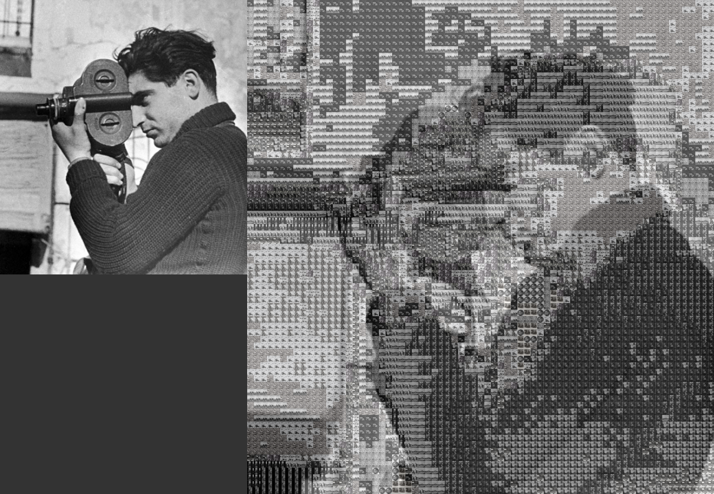
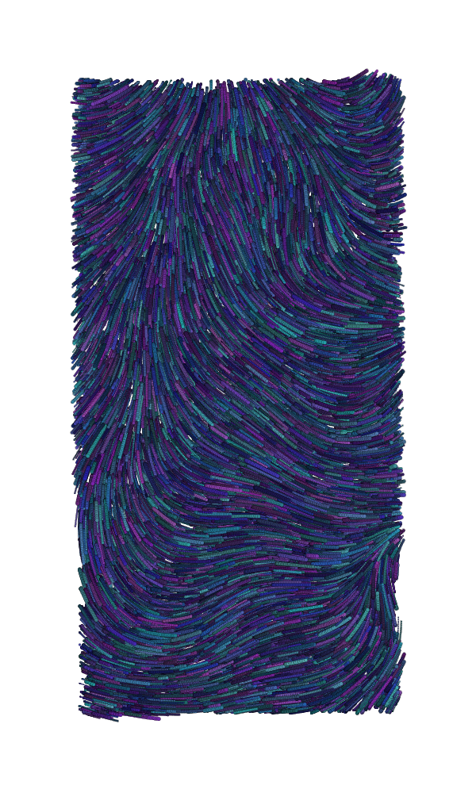

<h1>Processing sketches :art:</h1>

Here are some of my sketches done in processing, feel free to clone the source code and alter it yourself. I recommend playing with the settings on the flowfield, it's rather fun! :) 

<h4>Photo mosaic maker</h4>

<h4> Langton's Ant.</h4>

<h4> particles-JS recreation.</h4>

<h4>Perlin noise flowfield</h4>

<h4>Perlin noise 3D Terrain generation</h4>

<h4>misc</h4>

