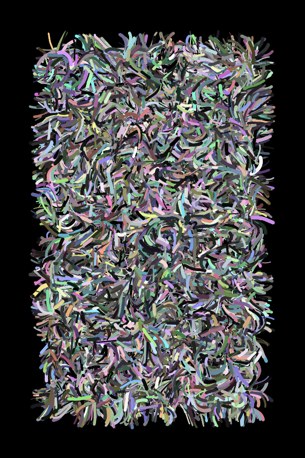

<h1>Processing sketches</h1>
<h1>:art:</h1>

Here are some of my sketches done in processing, feel free to clone the source code and alter it yourself. I recommend playing with the flowfield, it's rather fun! :) 

