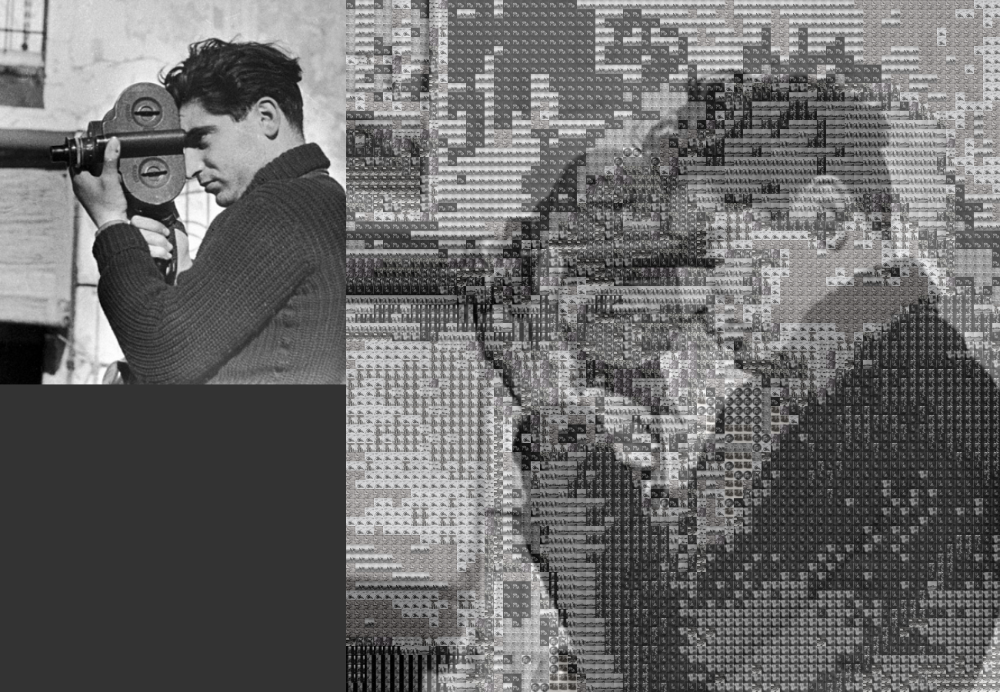
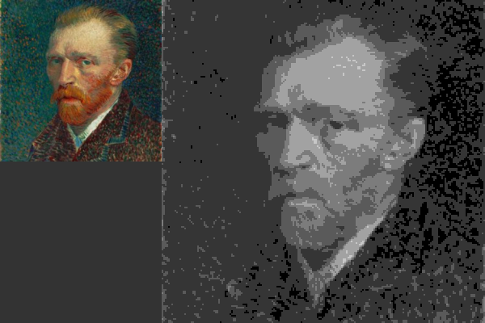
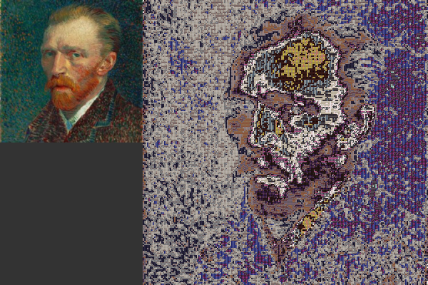
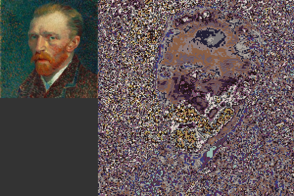
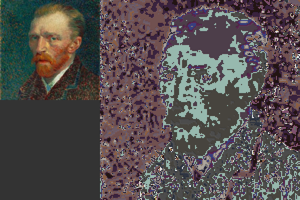

<h1>Photo mosaic creator</h1>

Here is an image of Robert Capa, a Hungarian-American war photographer. The image above, of him in action, is composed of 20 much smaller versions of his works. He is considered by some to be the greatest combat and adventure photographer in history. The Alt-J song "Taro" is named after his wife, professional partner and fellow photographer Gerda Taro.

This is finally working, here is a sample output below, it's Van Goph made up of eltons johns. :)

Still work to be done though, it's far from perfect but this was a great moment when it worked.

<h1>Experimenting!</h1>

Here I have altered the code to decide which image is most suitable based on either brightness, saturation or hue, each weilding very different results.

<h2>Brightness (B&W)</h2>

Here I used only black-white images of solid colours. only using greyscale images for the cells works far better and is much more soothing on the eye than the next 3 which use colour images.

<h2>Brightness</h2>

<h2>Saturation</h2>

<h2>Hue</h2>

